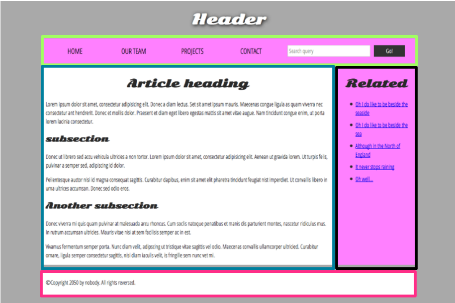
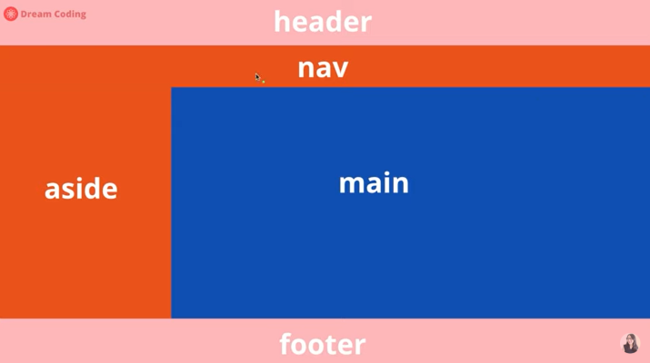
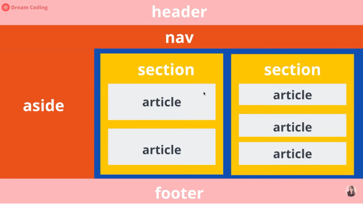
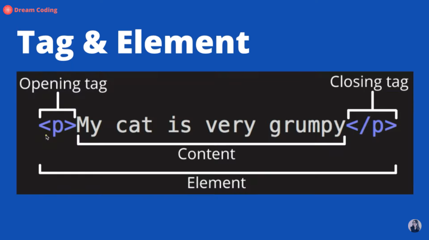
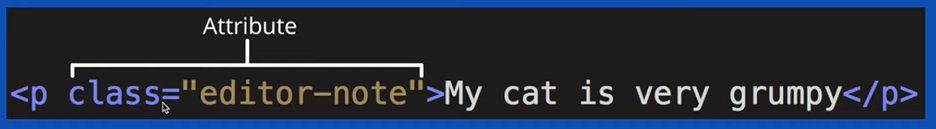

### 1. Project name : Learning HTML functions

- HTML : Hyper Text Makeup Language.
- Markup Language : System for annotating a document in a way that is visually distinguishable from the content, not freestyle.

### 2. Preiod : 2 days

### 3. Architecture diagram

### 4. Tag

#### 4-1. Concept

- Tag is key point regarding layout of HTML

#### 4-2. Interpreting tag commands

4-2-1. `<!DOCTYPE html>`: This should be declared at first and means "Declaration of document type version" is for HTML5. If a declaration is not included, various browswer will revert to "quick mode" for rendering.

4-2-2. `<html lang="en">`: Language code is english. If "ko", the code is korean.

4-2-3. `<head>`: This include a group of tags which define meta datas and help build up structures better even though not directly visible on screen.

- `<title></title>`: Title element help content be shown in a browser's title bar or page's tab as Bookmark. It only cotains text.
- `<meta>`: Meta element don't display datas on screen directly and help some datas display on location of screen correctly.
- `<meta charset="utf-8 /">`: Html encoding code help display text and special symbol on screen correctly.
- `<meta name="viewport" content="width-device-width, initial-scale=1.0" />`: Adjust display scaling according to screen size.
- `<link>`: Link element specifies relationships between the current document and external resource, and then, connection on them.
- `<link rel="stylesheet" href="style.css" />`: The file named "style.css" is linked to HTML.
- `<style>`: Style element contains CSS information on HTML directly.
- ``: Download main.js on sub directory named "src" in parallel parsing HTML. Please execute the file after parsing HTML.

4-2-4.`<body>`

- `<h1></h1>`: Heading. The larger number, the smaller font size.
- `<button></button>`: Button element represent clickable button, and you can change button's appearance with CSS.
- ` `: Br element produces a line break in text.
- `
`: Paragraph element represent content.
- `<b>`: Bold element is used to draw the reader's attention with boldface text.
- `<i>`: I element produces Italicized type text historically.
- `<a>`: Anchor element creats hyperlink to anything URL can address with its href attrbute.
  ex) `<a href="https://www.google.com>" target=_blank>click</a>`
- ``: Img element embeds image into the document
- `<table>`: Table element represent tabular data. That is information presented in two-dimensional table comprised of rows and columns of cells containing data.
- `

`: Div element is a generic container for flow content.
- ``: Span element is a generic inline container for phrasing content.
- `<ul></ul>`: Unordered list of items. It typically rendered as bulleted list.
- `<li></li>`: Item in list. It must be contained in a parent element, such as `<ol>`, `<ul>`, `<menu>`.
- `<article></article>`: Article element is a self-contained composition in a document, page, application, or site, which is intended to be independently distributable or reusable.

4-2-5. etc

- `<!--anotating-->`: Annotation command
- `ol>li*3 + Tab`: Creat 3 tags of `<li>` in `<ol>`. Please do not put space key between ol and li.
- `div.container>div.item.item${$}*10 + Tab`: Creat 10 tags of `
{$}` in `
`. Please do not put space key between container and div.

#### 4-3. Classified tags as box and item

4-3-1. Tag is classified as box or item
item means user can see display
box means help user section items

- box:
  `<header></header>`
  `<footer></footer>`
  `<nav></nav>`
  `<aside></aside>`
  `<section></section>`
  `<article></article>`
  `

`
  ``
- item:
  ``
  `

`
  `<button></button>`
  `</img>`
  `<h1></h1>`

4-3-2. Item can divide between block and inline to support understanding of CSS

- block: a content on a block. If over contents in case of block, change the line automatically regardless of extra space.
  `

`
  ex) `
This is sentence. 
That
 is..
`

- inline: add other contents with a content on a block. There could be many contents in a line if extra space exist.
  ``
  ex) `
This is sentence. That is..
`
  `<b></b>`
  ex) `
This is sentence. <b>That</b> is..
`
  `<label></label>`
  ex)`<label for="input name"></label>`
  `<input></input>`:use id with label when many input
  ex) `<input id="input name" type="text"></input>`
- Use tag below with `<li></li>` and attribute when list contents
  - `<ol></ol>`: ordered list
  - `<ul></ul>`: unordered list
